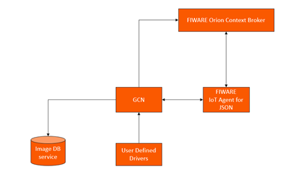

# GCN Architecture

In short terms, [GCN](https://github.com/Introsys/FIREFIT.ROSE-AP/tree/master/gcn) will make a configurable camera device available at Orion that allows users to capture images while storing them in a database service.

When [GCN](https://github.com/Introsys/FIREFIT.ROSE-AP/tree/master/gcn) starts, it communicates via HTTP with [Orion](https://fiware-orion.readthedocs.io/en/master/), creating the [Image Reference Entity](https://github.com/Introsys/FIREFIT.ROSE-AP/blob/master/gcn/data_models/image_reference.json) and the corresponding data persistency, ensured by [Cygnus](https://fiware-cygnus.readthedocs.io/en/latest/). Then, it communicates with [JSON IoT Agent](https://fiware-iotagent-json.readthedocs.io/en/latest/) also via HTTP to create the camera device, which in turn will create the corresponding entity at Orion (IoT Agent intrinsic functionality). From this point on, a camera device with the capture and configure commands is available at [Orion](https://fiware-orion.readthedocs.io/en/master/), and the intrinsic functionality of generic devices is ensured by the [JSON IoT Agent](https://fiware-iotagent-json.readthedocs.io/en/latest/).

At each capture command issued, the [GCN](https://github.com/Introsys/FIREFIT.ROSE-AP/tree/master/gcn) will perform the user-defined capture operation and will store the corresponding result at the image database service, updating the Image Reference Entity with the corresponding context data at Orion.

At each configure command issued, the [GCN](https://github.com/Introsys/FIREFIT.ROSE-AP/tree/master/gcn) will perform the user-defined camera configuration operation, updating the device attributes at Orion to reflect the current configuration.

To issue these commands one can use HTTP requests or direct MQTT messages, both respecting the FIWARE [JSON IoT Agent](https://fiware-iotagent-json.readthedocs.io/en/latest/) functionality. For the latter, one needs to be aware that the IoT Agent will not be handling the execution requests ([southbound functionality](https://fiware-tutorials.readthedocs.io/en/latest/iot-agent/index.html)) and therefore will not update the device context data to PENDING status for the corresponding command.

The following image presents how [GCN](https://github.com/Introsys/FIREFIT.ROSE-AP/tree/master/gcn) positions itself in a [FIWARE](https://fiware-tutorials.readthedocs.io/en/latest/index.html) solution:

  

    
  

  
Generic Camera Node

Note that the dependency on a message broker such as Mosquitto (depending on IoT Agent configuration) and on the entity data persistency service [Cygnus](https://fiware-cygnus.readthedocs.io/en/latest/) still exist. In the previous image, these can be considered to be implicitly included into the [IoT Agent](https://fiware-iotagent-json.readthedocs.io/en/latest/) and [Orion](https://fiware-orion.readthedocs.io/en/master/) respectively.

---

**Previous:** [Index](index.md) | **Next:** [Installation and Administration Guide](installationguide.md)
