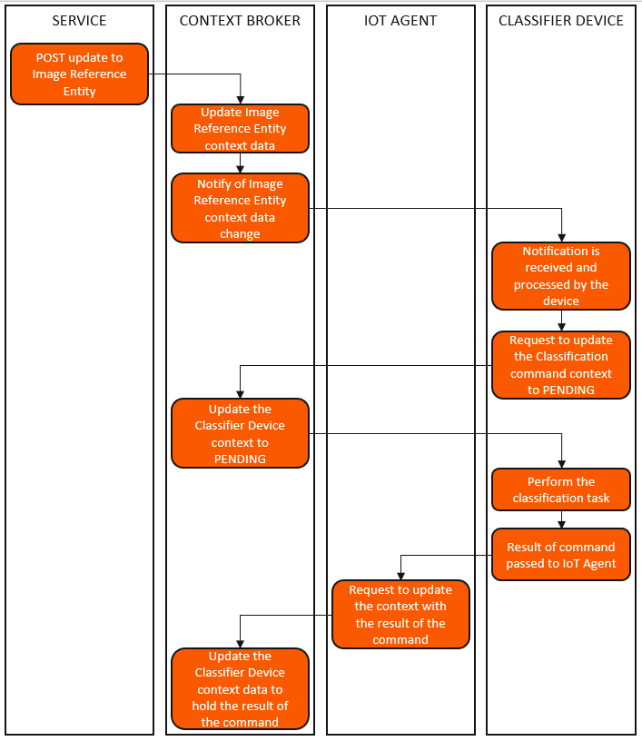
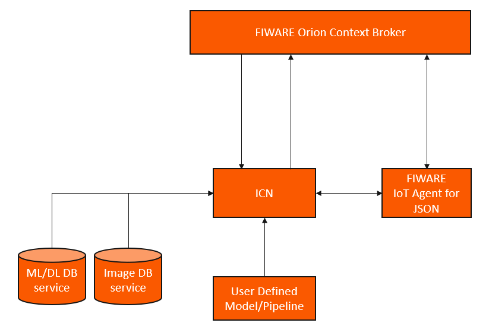

# ICN Architecture

In short terms, [ICN](https://github.com/Introsys/FIREFIT.ROSE-AP/tree/master/icn) will make a configurable image classifier device available at [Orion](https://fiware-orion.readthedocs.io/en/master/) that allows to perform automatic or on-demand image classification of images stored at an image database service, using a Machine Learning or Deep Leaning model available at a model database service. [ICN](https://github.com/Introsys/FIREFIT.ROSE-AP/tree/master/icn) was not designed to perform model training but to make use of such models instead.

When [ICN](https://github.com/Introsys/FIREFIT.ROSE-AP/tree/master/icn) starts, it communicates via HTTP with [Orion](https://fiware-orion.readthedocs.io/en/master/), creating the [Classification Result Entity](https://github.com/Introsys/FIREFIT.ROSE-AP/blob/master/icn/data_models/classification_result.json) and the corresponding data persistency, ensured by [Cygnus](https://fiware-cygnus.readthedocs.io/en/latest/). Then, it communicates with [JSON IoT Agent](https://fiware-iotagent-json.readthedocs.io/en/latest/) also via HTTP to create the classifier device, which in turn will create the corresponding entity at [Orion](https://fiware-orion.readthedocs.io/en/master/) (IoT Agent intrinsic functionality).

With the proper initial configuration performed, [ICN](https://github.com/Introsys/FIREFIT.ROSE-AP/tree/master/icn) then subscribes to the changes of a specified [Image Reference Entity](https://github.com/Introsys/FIREFIT.ROSE-AP/blob/master/gcn/data_models/image_reference.json) through [Orion](https://fiware-orion.readthedocs.io/en/master/)'s subscription mechanism, performing an image classification each time the entity is updated.

Additionally to the automatic image classification functionality, [ICN](https://github.com/Introsys/FIREFIT.ROSE-AP/tree/master/icn) is represented as a device at [Orion](https://fiware-orion.readthedocs.io/en/master/) with the `classify`, `listModels` and `selectModel` commands available through the intrinsic functionality of generic devices provided by [JSON IoT Agent](https://fiware-iotagent-json.readthedocs.io/en/latest/).

Each `classify` command receives a [Image Reference data model](https://github.com/Introsys/FIREFIT.ROSE-AP/blob/master/gcn/data_models/image_reference.json) as an input. According to the provided information, an image is consumed from the image database service, to which [ICN](https://github.com/Introsys/FIREFIT.ROSE-AP/tree/master/icn) is connected to, and the user-defined image classification operation is performed, updating the [Classification Result Entity](https://github.com/Introsys/FIREFIT.ROSE-AP/blob/master/icn/data_models/classification_result.json) with the corresponding context data at [Orion](https://fiware-orion.readthedocs.io/en/master/).

The `listModels` command allows to list all the available models at the model database to which [ICN](https://github.com/Introsys/FIREFIT.ROSE-AP/tree/master/icn) is connected to.

At each `selectModel` command, a model is selected to perform the following image classification tasks. The desired model needs to be available at the model database to which [ICN](https://github.com/Introsys/FIREFIT.ROSE-AP/tree/master/icn) is connected to.

To issue these commands, one can use HTTP requests or direct MQTT messages, both respecting the FIWARE [JSON IoT Agent](https://fiware-iotagent-json.readthedocs.io/en/latest/) functionality. For the latter, one needs to be aware that the IoT Agent will not be handling the execution requests ([southbound functionality](https://fiware-tutorials.readthedocs.io/en/latest/iot-agent/index.html)) and therefore will not update the device context data to `PENDING` status for the corresponding command.

It is important to mention that [Orion](https://fiware-orion.readthedocs.io/en/master/)'s subscription mechanism also does not trigger the IoT Agent [southbound functionality](https://fiware-tutorials.readthedocs.io/en/latest/iot-agent/index.html) and therefore there is no HTTP request issuing the `classify` command. The impact would be the classifier device context data never presenting the `PENDING` status for the `classify` command.

[ICN](https://github.com/Introsys/FIREFIT.ROSE-AP/tree/master/icn) handles the `PENDING` status update for the `classify` command, implementing the same behavior provided by the IoT Agent. The following diagram illustrates the described functionality and should be compared to the FIWARE IoT Agent for [southbound functionality](https://fiware.github.io/tutorials.IoT-Agent/img/command-swimlane.png).

  

    
  

  
ICN southbound traffic

The following image presents how [ICN](https://github.com/Introsys/FIREFIT.ROSE-AP/tree/master/icn) positions itself in a [FIWARE](https://fiware-tutorials.readthedocs.io/en/latest/index.html) solution:

  

    
  

  
Image Classification Node

Note that the dependency on a message broker such as Mosquitto (depending on IoT Agent configuration) and on the entity data persistency service [Cygnus](https://fiware-cygnus.readthedocs.io/en/latest/) still exist. In the previous image, these can be considered to be implicitly included into the [IoT Agent](https://fiware-iotagent-json.readthedocs.io/en/latest/) and [Orion](https://fiware-orion.readthedocs.io/en/master/) respectively.

[ICN](https://github.com/Introsys/FIREFIT.ROSE-AP/tree/master/icn) imposes that a [Image Reference data model](https://github.com/Introsys/FIREFIT.ROSE-AP/blob/master/gcn/data_models/image_reference.json) needs to be used to ensure its functionality, this requirements is fulfilled if the [Generic Camera Node (GCN)](https://github.com/Introsys/FIREFIT.ROSE-AP/tree/master/gcn) is used.

The [ICN](https://github.com/Introsys/FIREFIT.ROSE-AP/tree/master/icn) and [GCN](https://github.com/Introsys/FIREFIT.ROSE-AP/tree/master/gcn) were designed to work together, presenting an ideal synergy. Despite said synergy, they not have direct dependencies and allow usage as standalone services.

---

**Previous:** [Index](index.md) | **Next:** [Installation and Administration Guide](installationguide.md)
