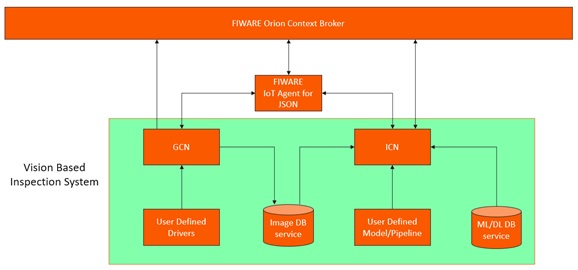

# FIREFIT ROSE-AP

This ROSE-AP solution is composed by two main components:

- The [Generic Camera Node (GCN)](https://github.com/Introsys/FIREFIT.ROSE-AP/tree/master/gcn) enables simple integration of industrial cameras in the [FIWARE](https://www.fiware.org/) ecosystem.
- The [Image Classification Node (ICN)](https://github.com/Introsys/FIREFIT.ROSE-AP/tree/master/icn) was designed to facilitate the development and integration of image processing algorithms and machine learning tools for feature classification in images.

Due to their [synergy](#synergy), it is possible to consider that any solution implementing the components herein presented is making use of a Vision-based Inspection System. Although this classification depends on the application, it is relevant in the context where ROSE-AP stands, since it was designed as an answer to requirements and optimizations imposed and identified by the [FIREFIT experiment](http://www.dih-squared.eu/TTE-FIREFIT).

The [flexibility](#flexibility) offered by these components relies heavily in the usage of [Python](https://www.python.org/), an increasingly popular programming language commonly used in Machine Learning and Deep Leaning contexts and hardware communication.

## Generic Camera Node

The [Generic Camera Node](https://github.com/Introsys/FIREFIT.ROSE-AP/tree/master/gcn) aims to easily integrate any type of camera into [FIWARE](https://www.fiware.org/) context as long as the necessary mechanisms to operate it can be programmed in [Python](https://www.python.org/). In short terms, the [GCN](https://github.com/Introsys/FIREFIT.ROSE-AP/tree/master/gcn) performs the following tasks:

- creates an [Image Reference Entity](https://github.com/Introsys/FIREFIT.ROSE-AP/blob/master/gcn/data_models/image_reference.json) directly at [Orion](https://fiware-orion.readthedocs.io/en/master/) and the corresponding data persistence at [MongoDB](https://www.mongodb.com/) through [Cygnus](https://fiware-cygnus.readthedocs.io/en/latest/),
- creates a representation of the camera as a device at [Orion](https://fiware-orion.readthedocs.io/en/master/) through the [IoT Agent](https://fiware-iotagent-json.readthedocs.io/en/latest/) with configuration and actuation available,
- creates a database instance at [MongoDB](https://www.mongodb.com/) to store the obtained images,
- updates the [Image Reference Entity](https://github.com/Introsys/FIREFIT.ROSE-AP/blob/master/gcn/data_models/image_reference.json) registered at [Orion](https://fiware-orion.readthedocs.io/en/master/) with a new image reference each time the camera captures and stores a new image.

This results in a device entity becoming available at [Orion](https://fiware-orion.readthedocs.io/en/master/) and to which the user can send configuration and capture commands. At each capture, the obtained image is automatically stored at the database and the [Image Reference Entity](https://github.com/Introsys/FIREFIT.ROSE-AP/blob/master/gcn/data_models/image_reference.json) is updated with the corresponding information. At each configuration command, the processes defined by the user are performed and the device context is also updated at [Orion](https://fiware-orion.readthedocs.io/en/master/).

Additional information regarding this component is presented in the [corresponding repository documentation](https://github.com/Introsys/FIREFIT.ROSE-AP/blob/master/gcn/README.md).

## Image Classification Node

The [Image Classification Node](https://github.com/Introsys/FIREFIT.ROSE-AP/tree/master/icn) aims to easily integrate image classification algorithms into [FIWARE](https://www.fiware.org/) context as long as the necessary elements can be programmed in [Python](https://www.python.org/). In short terms, the [ICN](icn) performs the following tasks:

- creates an [Classification Result Entity](https://github.com/Introsys/FIREFIT.ROSE-AP/blob/master/icn/data_models/classification_result.json) directly at [Orion](https://fiware-orion.readthedocs.io/en/master/) and the corresponding data persistence at [MongoDB](https://www.mongodb.com/) through [Cygnus](https://fiware-cygnus.readthedocs.io/en/latest/),
- creates a classifier device at [Orion](https://fiware-orion.readthedocs.io/en/master/) through the [IoT Agent](https://fiware-iotagent-json.readthedocs.io/en/latest/) with classification and model selection functionalities available,
- consumes images from a database,
- consumes models from a model database,
- performs automatic image classification by subscribing to entity changes as long as the entity respects the [Image Reference Entity](https://github.com/Introsys/FIREFIT.ROSE-AP/blob/master/gcn/data_models/image_reference.json) datamodel (also created by [GCN](https://github.com/Introsys/FIREFIT.ROSE-AP/tree/master/gcn)),
- updates the device command status to `PENDING` when making use of the subscription entity, since it does not go through the [IoT Agent](https://fiware-iotagent-json.readthedocs.io/en/latest/),
- updates the [Classification Result Entity](https://github.com/Introsys/FIREFIT.ROSE-AP/blob/master/icn/data_models/classification_result.json) registered at [Orion](https://fiware-orion.readthedocs.io/en/master/) with a new result each time a classification is performed.

This results in a device entity becoming available at [Orion](https://fiware-orion.readthedocs.io/en/master/) and to which the user can send classification and model selection commands. Prior to the classification task, a machine learning/deep learning model is consumed from the specified database and set as the currently active model. Being now able to classify images, the [ICN](https://github.com/Introsys/FIREFIT.ROSE-AP/tree/master/icn) will then consume images from the specified database each time there is an entity update or the user commands it to do so, classifies the image, and updates the [Classification Result Entity](https://github.com/Introsys/FIREFIT.ROSE-AP/blob/master/icn/data_models/classification_result.json) with the newly obtained result. It also allows the user to list the available models so that a new one can be defined as the active model.

Additional information regarding this component is presented in the [corresponding repository documentation](https://github.com/Introsys/FIREFIT.ROSE-AP/blob/master/icn/README.md).

## Synergy

Although the [GCN](https://github.com/Introsys/FIREFIT.ROSE-AP/tree/master/gcn) and [ICN](https://github.com/Introsys/FIREFIT.ROSE-AP/tree/master/icn) can be used as standalone components they were designed to work together, composing a Vision-based classification system or, in the context of the [FIREFIT experiment](http://www.dih-squared.eu/TTE-FIREFIT), a **Vision-based inspection system**.

To better understand how these components cooperate, an implementation example is presented in the following image:

  

    
  

  
Vision-based Inspection System

The first thing to note is that all the data persistency of [Orion](https://fiware-orion.readthedocs.io/en/master/) entities is taken care by [Cygnus](https://fiware-cygnus.readthedocs.io/en/latest/) and all the MQTT messaging is going through Mosquitto, these elements are not represented for the sake of simplicity.

Having a camera device defined by [GCN](https://github.com/Introsys/FIREFIT.ROSE-AP/tree/master/gcn) available at [Orion](https://fiware-orion.readthedocs.io/en/master/), the starting point of system operation comes from a capture command provided by the user or any user-defined service. That command is translated into a MQTT message by the [IoT Agent](https://fiware-iotagent-json.readthedocs.io/en/latest/) and sent to [GCN](https://github.com/Introsys/FIREFIT.ROSE-AP/tree/master/gcn). The capture operation is performed according to the logic provided by the user and the obtained image is stored into the image database service, concluding with a MQTT confirmation message stating the success. At the same time, the [GCN](https://github.com/Introsys/FIREFIT.ROSE-AP/tree/master/gcn) will send a direct HTTP message to [Orion](https://fiware-orion.readthedocs.io/en/master/) to have the corresponding [Image Reference Entity](https://github.com/Introsys/FIREFIT.ROSE-AP/blob/master/gcn/data_models/image_reference.json) updated with the most recent information. The [IoT Agent](https://fiware-iotagent-json.readthedocs.io/en/latest/) is aware of the MQTT confirmation message and will update the status of the device capture command.

As soon as the [Image Reference Entity]https://github.com/Introsys/FIREFIT.ROSE-AP/blob/master/gcn/data_models/image_reference.json) is updated, the [ICN](https://github.com/Introsys/FIREFIT.ROSE-AP/tree/master/icn) will be notified and will receive the corresponding content. In it, the image storage location is specified, allowing [ICN](https://github.com/Introsys/FIREFIT.ROSE-AP/tree/master/icn) to access the image database service and grab the newly created image. Having the image available, the user-defined classification process is then carried out using a Machine Learning or Deep Learning model previously selected by the user and obtained from the model database service. Since this process was triggered by the [Orion](https://fiware-orion.readthedocs.io/en/master/) subscription mechanism there was no classification command issued through JSON IoT Agent, for that reason the classifier device never got the opportunity to update its classification command status to `PENDING`, a task performed by the [IoT Agent](https://fiware-iotagent-json.readthedocs.io/en/latest/). The [ICN](https://github.com/Introsys/FIREFIT.ROSE-AP/tree/master/icn) fills this gap by producing the same behavior expected from [IoT Agent](https://fiware-iotagent-json.readthedocs.io/en/latest/) ensuring that the classifier device has its classification command status properly updated to `PENDING` together with the corresponding timestamp. From this process, a string stating the result of the classification is associated to the image, composing the necessary information to update the [Classification Result Entity](https://github.com/Introsys/FIREFIT.ROSE-AP/blob/master/icn/data_models/classification_result.json) through a HTTP message sent directly to [Orion](https://fiware-orion.readthedocs.io/en/master/). At the same time, a MQTT command confirmation message is published, being this time the [IoT Agent](https://fiware-iotagent-json.readthedocs.io/en/latest/) the one responsible to update the classification command status of the classifier device.

This way, with a simple camera capture command, a whole process of image capture, storage and classification is automatically performed, ensuring all the data persistency, status update and the flexibility to select models according to each need, abstracting the user from complex configurations necessary to interact with [FIWARE](https://www.fiware.org/) and Third-party components.

## Flexibility

In this section a brief description of the flexibility offered by each of the proposed components is presented, more information is provided at each corresponding repository documentation.

The [GCN](https://github.com/Introsys/FIREFIT.ROSE-AP/tree/master/gcn) component allows users to program the processes of capture and configuration of the cameras they wish to integrate as long as [Python](https://www.python.org/) is used. It is up to the user to define how the communication to the camera is established, how it is configured and how the capture operation is performed. This allows users to use any type of communication protocol, manufacturer specific libraries and camera specific parameterization. Since these processes are defined in [Python](https://www.python.org/), any additional libraries can be imported and used. Although all the typical functionality of a generic device is ensured through the [IoT Agent](https://fiware-iotagent-json.readthedocs.io/en/latest/), the user can also operate this component through direct MQTT messages, always considering that the device entity will not have its command attributes updated to `PENDING` status.

The [ICN](https://github.com/Introsys/FIREFIT.ROSE-AP/tree/master/icn) component allows users to program the image classification process as long as [Python](https://www.python.org/) is used. It is up to the user to define the model loading, image preprocessing and image classification processes. This allows users to use any library and pipeline as long as they are compatible with [Python](https://www.python.org/). The image subject to classification is provided automatically by the component since it is consumed from the image database service. Regarding the model usage, this component only makes use of existing machine learning/deep learning models stored in the model database service. It allows the user to list and select the desired model but it is up to the user to ensure the instantiation of the model. Although all the typical functionality of a generic device is ensured through the [IoT Agent](https://fiware-iotagent-json.readthedocs.io/en/latest/), the user can also operate this component through direct MQTT messages, always considering that the device entity will not have its command attributes updated to `PENDING` status.

It is imperative that all the necessary structures and usage condition is respected, as specified in the  documentation.

## Introsys

[Introsys](https://www.introsys.eu/?lang=en) is a technology provider and system integrator company dedicated on the creation of customized solutions for automation, control systems and quality inspection.

## FIWARE

[FIWARE](https://www.fiware.org/) is a curated framework of open source platform components which can be assembled together and with other third-party platform components to accelerate the development of Smart Solutions.

## License

The FIREFIT ROSE-AP components are licensed under [Affero General Public License (AGPL) version 3](https://github.com/Introsys/FIREFIT.ROSE-AP/blob/master/LICENSE).

© 2021 Introsys, S.A.
