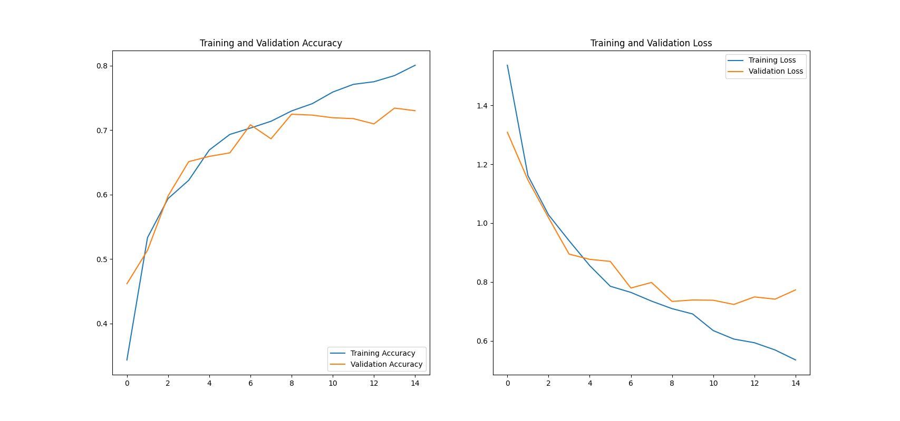

# Getting Started

In this section, a [ICN](../) configuration and usage example is presented.

> ***Be aware that the following content should be used as a reference only and not as a production ready solution. There are several security concerns that should be taken into account depending on the context where ICN will operate.***

In order to demonstrate the functionality of [ICN](../) as a standalone service, it would require to configure an image database service, store images there and compose the corresponding reference into a [Image Reference data model](../../gcn/data_models/image_reference.json), comprising the requirements to execute a `classify` command. All of these tasks are automatically taken care of when using the [Generic Camera Node (GCN)](../../gcn) component. Using it in the current example will not only simplify the explanation of ICN but also demonstrate the convenient synergy between the two components. It is important to understand that GCN in this context will not actually connect to a camera but will assume its responsibility of obtaining images.

Reading the [Generic Camera Node (GCN) documentation](../../gcn/docs) is, for the above reasons, highly recommended and it will be assumed for the current example that such knowledge is acquired.

Machine Learning and Deep Learning frameworks are usually complex and present distinct ways to apply the same mathematical concepts. For the present example, the [image classification tutorial](https://www.tensorflow.org/tutorials/images/classification) presented by the popular [TensorFlow](https://www.tensorflow.org) library will be used to showcase how it could be implemented into a FIWARE solution using [GCN](../../gcn) and [ICN](../).

In order to produce the same results as presented here, it is advised to use the [Visual Studio Code](https://code.visualstudio.com/) [REST Client extension](https://github.com/Huachao/vscode-restclient) to perform HTTP requests, it is also available at the Extensions menu.

As a starting point, although the [GCN](../../gcn) and [ICN](../) images are not yet created, it is important to define and understand which services are necessary to ensure the solution functionality, as mentioned in the [Installation and Administration Guide](installationguide.md). For this reason, the following [`docker-compose.yml`](../docker/docker-compose.yml) file represents the deployment of the present example:

```yaml
version: "3.5"
services:
  # Orion is the context broker
  orion:
    image: fiware/orion:2.4.0
    hostname: orion
    container_name: fiware-orion
    depends_on:
      - mongo-db
    networks:
      - default
    ports:
      - "1026:1026"
    command: -dbhost mongo-db -logLevel DEBUG -noCache -insecureNotif

  # Databases
  mongo-db:
    image: mongo:3.6
    hostname: mongo-db
    container_name: db-mongo
    expose:
      - "27017"
    ports:
      - "27017:27017"
    networks:
      - default
    command: --bind_ip_all --smallfiles
  
  # IoT Agent (JSON)
  iot-agent:
    image: fiware/iotagent-json:latest
    hostname: iot-agent
    container_name: fiware-iot-agent
    depends_on:
        - mongo-db
    networks:
        - default
    expose:
        - "4041"
    ports:
        - "4041:4041"
    environment:
        - IOTA_CB_HOST=orion
        - IOTA_CB_PORT=1026
        - IOTA_NORTH_PORT=4041
        - IOTA_REGISTRY_TYPE=mongodb
        - IOTA_LOG_LEVEL=DEBUG
        - IOTA_TIMESTAMP=true
        - IOTA_CB_NGSI_VERSION=v2
        - IOTA_AUTOCAST=true
        - IOTA_MONGO_HOST=mongo-db
        - IOTA_MONGO_PORT=27017
        - IOTA_MONGO_DB=iotagentjson
        - IOTA_PROVIDER_URL=http://iot-agent:4041
        - IOTA_DEFAULT_RESOURCE=/iot/json
        - IOTA_MQTT_HOST=mosquitto
        - IOTA_MQTT_PORT=1883

  # MQTT broker
  mosquitto:
    image: eclipse-mosquitto
    hostname: mosquitto
    container_name: mosquitto
    networks:
        - default
    expose:
        - "1883"
    ports:
        - "1883:1883"
    volumes:
        - type: bind
          source: ./mosquitto/config
          target: /mosquitto/config
  
  # Data Persistence
  cygnus:
    image: fiware/cygnus-ngsi:latest
    hostname: cygnus
    container_name: fiware-cygnus
    depends_on:
        - mongo-db
    networks:
        - default
    environment:
        - "CYGNUS_MONGO_HOSTS=mongo-db:27017"
        - "CYGNUS_MONGO_SERVICE_PORT=5051"
        - "CYGNUS_LOG_LEVEL=DEBUG"
        - "CYGNUS_API_PORT=5080"
        - "CYGNUS_SERVICE_PORT=5051"

  # GCN
  gcn:
    image: gcn
    hostname: gcn
    container_name: gcn
    depends_on:
        - orion
        - iot-agent
        - mosquitto
        - mongo-db
    networks:
        - default

  # ICN
  icn:
    image: icn
    hostname: icn
    container_name: icn
    depends_on:
        - orion
        - iot-agent
        - mosquitto
        - mongo-db
    networks:
        - default
    expose:
        - "8181"
    ports:
        - "8181:8181"

networks:
  default:
    ipam:
      config:
        - subnet: 172.18.1.0/24

volumes:
  mongo-db: ~

```

The relevant elements to consider regarding the [`docker-compose`](../docker/docker-compose.yml) are:

- The usage of `MQTT` protocol and therefore the `mosquitto` broker
- `hostname` of each service
- `expose` specified ports, stating that those ports will be exposed within the **docker network**
- `ports` specified ports, stating that those ports will be exposed to the **host machine**

A description of the complete addresses (address:port) for each service, given the presented [`docker-compose`](../docker/docker-compose.yml) is as follows:

- Orion - `orion:1026`
- MongoDB - `mongo-db:27017`
- JSON IoT Agent - `iot-agent:4041`
- Mosquitto (MQTT broker) - `mosquitto:1883`
- Cygnus - `cygnus:5051`
- ICN - `icn:8181`

Having a deployment that ensures the minimal service requirements for [GCN](../../gcn) and [ICN](../), the next step is to configure the necessary files before building the [GCN](../../gcn) and [ICN](../) images.

Starting with [GCN](../../gcn), the same approach taken for the component [usage example](../../gcn/docs/getting-started.md) will be considered, but instead of generating a [NumPy](https://numpy.org/) array, the same image from [TensorFlow image classification tutorial](https://www.tensorflow.org/tutorials/images/classification#predict_on_new_data) prediction step will be used.

The [GCN](../../gcn) [`configuration.json`](../../gcn/configuration/configuration.json) file remains unaltered, when compared to its [usage example](../../gcn/docs/getting-started.md):

```json
{
    "cb_endpoint": "http://orion:1026",
    "cygnus_endpoint": "http://cygnus:5051",
    "iota_endpoint": "http://iot-agent:4041",
    "iota_protocol": "MQTT",
    "protocol_broker_address": "mosquitto",
    "protocol_broker_port": "1883",
    "entity_id": "urn:ngsi-ld:ImageRecord:001",
    "camera_id": "urn:ngsi-ld:Camera:001",
    "api_key": "camera",
    "service": "production",
    "service_path": "manufacturer",
    "sink": "mongo",
    "sink_endpoint": "mongodb://mongo-db:27017"
}
```

As for the [`camera.py`](../../gcn/gcn_lib/camera.py), it will receive all the necessary code to embrace the [TensorFlow image classification tutorial](https://www.tensorflow.org/tutorials/images/classification#predict_on_new_data) approach:

```python
import PIL
import json
import pickle
import base64
import tensorflow as tf
from random import randrange
from tensorflow import keras

class Camera:
    def __init__(self):
        self.connection_exceptions = ()
        self.__img_height = 180
        self.__img_width = 180
        self.__sunflower_url = "https://storage.googleapis.com/download.tensorflow.org/example_images/592px-Red_sunflower.jpg"
        self.__sunflower_path = None
        pass

    def connect(self):
        print('DEBUG CONNECT')
        pass

    def disconnect(self):
        print('DEBUG DISCONNECT')
        pass

    def initialize(self):
        print('DEBUG INITIALIZE')
        self.__sunflower_path = tf.keras.utils.get_file('Red_sunflower', origin=self.__sunflower_url)
        pass

    def capture(self) -> str:
        print('DEBUG CAPTURE')

        img = keras.preprocessing.image.load_img(
            self.__sunflower_path, target_size=(self.__img_height, self.__img_width)
        )
        img_array = keras.preprocessing.image.img_to_array(img)
        img_array = tf.expand_dims(img_array, 0)  # Create a batch

        # Encode image
        array_bytes = pickle.dumps(img_array)
        encoded = base64.b64encode(array_bytes)
        array_string = encoded.decode('ascii')

        # Necessary structure to store
        image = {
            "filename": "red_sunflower_{}".format(randrange(2000)),
            "image": array_string
        }

        return_string = json.dumps(image)

        print('DEBUG RETURN STRING:', return_string)

        return return_string

    def configure(self, parameters):
        print('DEBUG CONFIGURE', parameters)
        pass
```

As mentioned, although [GCN](../../gcn) is not connecting to a camera it assumes its responsibility to *obtain* images, which in this case is the example used in the tutorial and kindly provided by [TensorFlow](https://www.tensorflow.org). Note that the encoding strategy, when compared to [GCN's usage example](../../gcn/docs/getting-started.md), remains the same and all the necessary variables to reproduce the tutorial are coded as parameters of the `Camera` class.

As for the [`Dockerfile`](../Dockerfile), [NumPy](https://numpy.org/) is no longer necessary, but [TensorFlow](https://www.tensorflow.org) is:

```Dockerfile
FROM python:3.8-slim-buster

WORKDIR /app

ADD . /app

RUN pip install -r requirements.txt

# user modules
RUN pip install tensorflow

CMD ["python", "./cgn.py"]
```

The Docker image is then [created](https://docs.docker.com/engine/reference/commandline/build/) with the name `gcn`:

> ***The docker image name must correspond to the one defined at the docker-compose.yml file presented at the beginning of the example.***

```console
docker build -t gcn .
```

From this point, [GCN](../../gcn) is ready to be used in the example while [ICN](../) still needs to be subject to configuration, starting with its [`configuration.json`](../configuration/configuration.json) file:

```json
{
    "cb_endpoint": "http://orion:1026",
    "cygnus_endpoint": "http://cygnus:5051",
    "iota_endpoint": "http://iot-agent:4041",
    "iota_protocol": "MQTT",
    "protocol_broker_address": "mosquitto",
    "protocol_broker_port": "1883",
    "entity_id": "urn:ngsi-ld:ImageClassification:001",
    "image_entity_id": "urn:ngsi-ld:ImageRecord:001",
    "classifier_id": "urn:ngsi-ld:ImageClassifier:001",
    "api_key": "classifier",
    "service": "models",
    "service_path": "flowers",
    "model_db_type": "mongo",
    "model_db_endpoint": "mongodb://mongo-db:27017",
    "host_ip": "icn",
    "host_port": "8181"
}
```

By comparing with the [`docker-compose`](../docker/docker-compose.yml), it is possible to quickly correlate the defined parameters with the `hostname` and exposed/configured ports of each service.

The id `urn:ngsi-ld:ImageClassification:001` will be assigned to the [Classification Result Entity](../data_models/classification_result.json) that will be created at Orion.

The id `urn:ngsi-ld:ImageClassifier:001` will be assigned to the classifier device that will be created at Orion through JSON IoT Agent.

The id `urn:ngsi-ld:ImageRecord:001` needs and does correspond to the [Image Reference Entity](../../gcn/data_models/image_reference.json) id configured for [GCN](../../gcn).

The models that will be considered as available will be the ones stored at the `flowers` collection of the `models` database from a MongoDB instance (`mongo` defined as `model_db_type`).

Knowing that Orion needs to publish information through HTTP requests to [ICN](../), it is imperative to have `host_ip` and `host_port` compose an address to which Orion can reach, since both services share the same docker network, a `hostname` will suffice.

Regarding the [`classifier.py`](../icn_lib/classifier.py) file, it needs to embrace all the necessary code to reproduce the [TensorFlow image classification tutorial](https://www.tensorflow.org/tutorials/images/classification#predict_on_new_data). As already mentioned, [ICN](../) only makes use of models and does not train them. For that reason, the [`classifier.py`](../icn_lib/classifier.py) will be prepared to consume models that were saved in the model database service as a `zip` archive containing the files generated by the [TensorFlow's model save function](https://www.tensorflow.org/tutorials/keras/save_and_load#save_the_entire_model) when using the `SavedModel` format, default for `TF2.x.`:

```python
import shutil
import base64
import pickle
import numpy as np
import tensorflow as tf

class Classifier:
    def __init__(self):
        self.__class_names = ['daisy', 'dandelion', 'roses', 'sunflowers', 'tulips']
        pass

    def initialization(self):
        print('DEBUG INITIALIZATION')
        pass

    def assign_model(self, db_file) -> object:
        print('DEBUG ASSIGN MODEL')

        # reconstruct zip file from binary data
        with open('temp.zip', 'wb') as f:
            f.write(db_file)
        
        # extract zip file
        filename = './temp.zip'
        target_dir = './flowers_model'
        archive_format = 'zip'
        shutil.unpack_archive(filename, target_dir, archive_format)

        # load model
        model = tf.keras.models.load_model('./flowers_model')

        print('DEBUG MODEL:', model)

        return model

    def preprocess(self, image) -> object:
        print('DEBUG PREPROCESS')

        # decode binary
        decoded_img_array = base64.b64decode(image)

        # convert to array
        img_array = pickle.loads(decoded_img_array)

        return img_array

    def classify(self, preprocessed_image, model) -> str:
        # predict
        predictions = model.predict(preprocessed_image)
        score = tf.nn.softmax(predictions[0])

        print(
            "This image most likely belongs to {} with a {:.2f} percent confidence.".format(
                self.__class_names[np.argmax(score)], 100 * np.max(score)
            )
        )

        # classify
        classification = self.__class_names[np.argmax(score)]

        return classification
```

For simplicity sake, the `class_names` used in the tutorial were hardcoded as a class property.

The `assign_model` presents the process to reconstruct the `binary` data sent from the MongoDB instance back into a `zip` archive, extract its content (previously saved model) and load it into a TensorFlow model instance.

The `preprocess` function for the present case, will only revert the encoding performed by the GCN at its `capture` function.

Finally, the `classify` replicates the corresponding code presented at the [TensorFlow image classification tutorial](https://www.tensorflow.org/tutorials/images/classification#predict_on_new_data) to effectively classify each image.

The configuration for the remaining [`Dockerfile`](../Dockerfile) will include the necessary [TensorFlow](https://www.tensorflow.org) and [NumPy](https://numpy.org/) install commands, since both are used in the [`classifier.py`](../icn_lib/classifier.py) code:

```Dockerfile
FROM python:3.8-slim-buster

WORKDIR /app

ADD . /app

RUN pip install -r requirements.txt

# user modules
RUN pip install numpy
RUN pip install tensorflow

CMD ./start.sh
```

This concludes all the necessary configuration for [ICN](../), that will [generate a docker image](https://docs.docker.com/engine/reference/commandline/build/) with the name `icn`:

> ***The docker image name must correspond to the one defined at the docker-compose.yml file presented at the beginning of the example.***

```console
docker build -t icn .
```

Having [GCN](../../gcn) and [ICN](../) Docker images ready, the [`docker-compose.yml`](../docker/docker-compose.yml) file can be used to create all the service instances:

```console
docker-compose -p firefit_stack up -d
```

By running the docker command to check the running containers:

```console
docker container ls --all
```

One should obtain the following result:

```console
CONTAINER ID   IMAGE                         COMMAND                  CREATED       STATUS       PORTS                              NAMES
752deba8f1fa   icn                           "/bin/sh -c ./start.…"   3 hours ago   Up 3 hours   0.0.0.0:8181->8181/tcp             icn
bdd02e335d84   gcn                           "python ./cgn.py"        3 hours ago   Up 3 hours                                      gcn
f41a7eda8006   fiware/iotagent-json:latest   "docker/entrypoint.s…"   3 hours ago   Up 3 hours   0.0.0.0:4041->4041/tcp, 7896/tcp   fiware-iot-agent
0363fda9a8d4   fiware/orion:2.4.0            "/usr/bin/contextBro…"   3 hours ago   Up 3 hours   0.0.0.0:1026->1026/tcp             fiware-orion
e0153bed0459   fiware/cygnus-ngsi:latest     "/cygnus-entrypoint.…"   3 hours ago   Up 3 hours   5050/tcp, 5080/tcp                 fiware-cygnus
352cf0bc61da   eclipse-mosquitto             "/docker-entrypoint.…"   3 hours ago   Up 3 hours   0.0.0.0:1883->1883/tcp             mosquitto
12f7d56945fd   mongo:3.6                     "docker-entrypoint.s…"   3 hours ago   Up 3 hours   0.0.0.0:27017->27017/tcp           db-mongo
```

Using [Visual Studio Code](https://code.visualstudio.com/) with the [REST Client extension](https://github.com/Huachao/vscode-restclient), it is possible to query Orion for its entities:

```http
### Get Orion Entities
GET http://localhost:1026/v2/entities
```

Which should respond with the following result:

```http
HTTP/1.1 200 OK
Connection: close
Content-Length: 604
Content-Type: application/json
Fiware-Correlator: 3270ab48-9302-11eb-ab2f-0242ac120104
Date: Thu, 01 Apr 2021 15:52:01 GMT

[
  {
    "id": "urn:ngsi-ld:ImageRecord:001",
    "type": "imageReference",
    "image": {
      "type": "reference",
      "value": {
        "databaseType": "mongo",
        "databaseEndpoint": "mongodb://mongo-db:27017",
        "database": "production",
        "collection": "/manufacturer",
        "imageFile": ""
      },
      "metadata": {}
    }
  },
  {
    "id": "urn:ngsi-ld:ImageClassification:001",
    "type": "classificationResult",
    "classification": {
      "type": "result",
      "value": {
        "imageDatabaseEndpoint": "",
        "imageDatabase": "",
        "imageCollection": "",
        "imageFile": "",
        "modelDatabase": "models",
        "modelCollection": "/flowers",
        "modelDatabaseEndpoint": "mongodb://mongo-db:27017",
        "model": "",
        "classification": ""
      },
      "metadata": {}
    }
  }
]
```

The [Image Reference Entity](../../gcn/data_models/image_reference.json) and [Classification Result Entity](../data_models/classification_result.json) with the respective `urn:ngsi-ld:ImageRecord:001` and `urn:ngsi-ld:ImageClassification:001` configured ids, were successfully created at Orion.

The successful creation of the camera device is proven at [GCN usage example](../../gcn/docs/getting-started.md), being here relevant the confirmation of the proper creation of the classifier device entity. To do so, `service` and `service-path` need to be considered when querying Orion:

```http
### Device entities at models service and flowers service-path
GET http://localhost:1026/v2/entities
fiware-service: models
fiware-servicepath: /flowers
```

The response should be as follows:

```http
HTTP/1.1 200 OK
Connection: close
Content-Length: 808
Content-Type: application/json
Fiware-Correlator: 1cdfc722-9303-11eb-8e94-0242ac120104
Date: Thu, 01 Apr 2021 15:58:34 GMT

[
  {
    "id": "urn:ngsi-ld:ImageClassifier:001",
    "type": "classifier",
    "TimeInstant": {
      "type": "DateTime",
      "value": "2021-04-01T15:50:42.00Z",
      "metadata": {}
    },
    "activeModel": {
      "type": "String",
      "value": " ",
      "metadata": {}
    },
    "classify_info": {
      "type": "commandResult",
      "value": " ",
      "metadata": {}
    },
    "classify_status": {
      "type": "commandStatus",
      "value": "UNKNOWN",
      "metadata": {}
    },
    "listModels_info": {
      "type": "commandResult",
      "value": " ",
      "metadata": {}
    },
    "listModels_status": {
      "type": "commandStatus",
      "value": "UNKNOWN",
      "metadata": {}
    },
    "selectModel_info": {
      "type": "commandResult",
      "value": " ",
      "metadata": {}
    },
    "selectModel_status": {
      "type": "commandStatus",
      "value": "UNKNOWN",
      "metadata": {}
    },
    "classify": {
      "type": "command",
      "value": "",
      "metadata": {}
    },
    "listModels": {
      "type": "command",
      "value": "",
      "metadata": {}
    },
    "selectModel": {
      "type": "command",
      "value": "",
      "metadata": {}
    }
  }
]
```

The expected device configuration is achieved, being a classifier device presented with the `classify`, `listModels` and `selectModel` commands as well as the `activeModel` attribute stating the currently active model. The configured id `urn:ngsi-ld:ImageClassifier:001` is also confirmed. Just like in the [GCN usage example](../../gcn/docs/getting-started.md), a query to JSON IoT Agent will be performed to validate that the same device representation is defined:

```http
### Devices defined at production service and manufacturer service-path
GET http://localhost:4041/iot/devices
fiware-service: production
fiware-servicepath: /manufacturer
```

The response should be as follows:

```http
HTTP/1.1 200 OK
X-Powered-By: Express
Fiware-Correlator: 886fa4d2-0ab3-442c-82df-93f760de5e94
Content-Type: application/json; charset=utf-8
Content-Length: 566
ETag: W/"236-8+WKFiwmy9Erz36TEQmLpFJDo5I"
Date: Thu, 01 Apr 2021 16:03:07 GMT
Connection: close

{
  "count": 1,
  "devices": [
    {
      "device_id": "urn:ngsi-ld:ImageClassifier:001",
      "service": "models",
      "service_path": "/flowers",
      "entity_name": "urn:ngsi-ld:ImageClassifier:001",
      "entity_type": "classifier",
      "transport": "MQTT",
      "attributes": [
        {
          "object_id": "activeModel",
          "name": "activeModel",
          "type": "String"
        }
      ],
      "lazy": [],
      "commands": [
        {
          "object_id": "classify",
          "name": "classify",
          "type": "command"
        },
        {
          "object_id": "listModels",
          "name": "listModels",
          "type": "command"
        },
        {
          "object_id": "selectModel",
          "name": "selectModel",
          "type": "command"
        }
      ],
      "static_attributes": [],
      "protocol": "json",
      "explicitAttrs": false
    }
  ]
}
```

The same device structure is presented, an expected result since it is the JSON IoT Agent the one responsible for creating the device entity at Orion.

Another important query to JSON IoT Agent will determine if the proper `api_key` was defined, it is an important element since it will define part of the `MQTT` topics to which the IoT Agent will publish and subscribe to:

```http
### Check IoT Agent Services for the models service and any (*) service-path
GET http://localhost:4041/iot/services
fiware-service: models
fiware-servicepath: /*
```

The response should be as follows:

```http
HTTP/1.1 200 OK
X-Powered-By: Express
Fiware-Correlator: d0283ad6-b049-4891-be59-f23dd551e1ba
Content-Type: application/json; charset=utf-8
Content-Length: 270
ETag: W/"10e-m+M9t2z+CRXlpAi7N5uivGCVgRU"
Date: Thu, 01 Apr 2021 16:04:44 GMT
Connection: close

{
  "count": 1,
  "services": [
    {
      "commands": [],
      "lazy": [],
      "attributes": [],
      "_id": "6065ebd2bc14130008a18657",
      "resource": "/iot/json",
      "apikey": "classifier",
      "service": "models",
      "subservice": "/flowers",
      "__v": 0,
      "static_attributes": [],
      "internal_attributes": [],
      "entity_type": "classifier"
    }
  ]
}
```

One can infer that the `api_key`, `service` and `service-path` defined at the [`configuration.json`](../configuration/configuration.json) are properly defined as a service, a mechanism used by [JSON IoT Agent](https://fiware-iotagent-json.readthedocs.io/en/latest/stepbystep/index.html).

The only remaining element that is yet to be confirmed regarding Orion is the [Classification Result Entity](../data_models/classification_result.json) data persistency and that ICN is properly subscribed to the [Image Reference Entity](../../gcn/data_models/image_reference.json) changes. To do so, a query to Orion's subscriptions will be performed:

```http
### Orion subscriptions
GET http://localhost:1026/v2/subscriptions
```

Yielding the response:

```http
HTTP/1.1 200 OK
Connection: close
Content-Length: 1462
Content-Type: application/json
Fiware-Correlator: 5e9fa7a8-9304-11eb-ad08-0242ac120104
Date: Thu, 01 Apr 2021 16:07:34 GMT

[
  {
    "id": "6065ebccc8b524538c87ce54",
    "description": "ICN API subscription.",
    "status": "active",
    "subject": {
      "entities": [
        {
          "id": "urn:ngsi-ld:ImageRecord:001",
          "type": "imageReference"
        }
      ],
      "condition": {
        "attrs": [
          "image"
        ]
      }
    },
    "notification": {
      "timesSent": 1,
      "lastNotification": "2021-04-01T15:50:39.00Z",
      "attrs": [],
      "onlyChangedAttrs": false,
      "attrsFormat": "normalized",
      "http": {
        "url": "http://icn:8181/classifier/urn:ngsi-ld:ImageClassifier:001"
      },
      "lastSuccess": "2021-04-01T15:50:39.00Z",
      "lastSuccessCode": 200
    }
  },
  {
    "id": "6065ebcfc8b524538c87ce55",
    "description": "Image Reference data persistence subscription.",
    "status": "active",
    "subject": {
      "entities": [
        {
          "id": "urn:ngsi-ld:ImageRecord:001",
          "type": "imageReference"
        }
      ],
      "condition": {
        "attrs": [
          "image"
        ]
      }
    },
    "notification": {
      "timesSent": 1,
      "lastNotification": "2021-04-01T15:50:39.00Z",
      "attrs": [],
      "onlyChangedAttrs": false,
      "attrsFormat": "normalized",
      "http": {
        "url": "http://cygnus:5051/notify"
      },
      "lastSuccess": "2021-04-01T15:50:39.00Z",
      "lastSuccessCode": 200
    }
  },
  {
    "id": "6065ebd1c8b524538c87ce57",
    "description": "Classification data persistence subscription.",
    "status": "active",
    "subject": {
      "entities": [
        {
          "id": "urn:ngsi-ld:ImageClassification:001",
          "type": "classificationResult"
        }
      ],
      "condition": {
        "attrs": [
          "classification"
        ]
      }
    },
    "notification": {
      "timesSent": 1,
      "lastNotification": "2021-04-01T15:50:41.00Z",
      "attrs": [],
      "onlyChangedAttrs": false,
      "attrsFormat": "normalized",
      "http": {
        "url": "http://cygnus:5051/notify"
      },
      "lastSuccess": "2021-04-01T15:50:41.00Z",
      "lastSuccessCode": 200
    }
  }
]
```

Based on the results, Orion is notifying Cygnus regarding changes to the [Classification Result Entity](../data_models/classification_result.json) and [Image Reference Entity](../../gcn/data_models/image_reference.json). Fiware provides a detailed [step-by-step guide](https://fiware-tutorials.readthedocs.io/en/latest/historic-context-flume/index.html#mongodb-reading-data-from-a-database) on how to confirm that data is being persisted. For that reason, the process will not be replicated in the present document.

Additionally, Orion is notifying [ICN](../) regarding changes to [Image Reference Entity](../../gcn/data_models/image_reference.json) through the configured endpoint `http://icn:8181/classifier/urn:ngsi-ld:ImageClassifier:001`, confirming that [ICN](../) is aware of changes done to the entity.

With all the automatic configurations performed by ICN analyzed (GCN was subject to the same analysis in its [usage example](../../gcn/docs/getting-started.md)), it is important to check [ICN](../) logs by executing the following docker command:

```console
docker logs icn
```

Due to the fact that [ICN](../) has two running services, the API and the application, the logs are more extensive than the ones presented by [GCN](../../gcn) and will not be presented here. Other than eventual errors during boot, there is no specific note to take at this point since the model selection was not yet performed and therefore the code from [`classifier.py`](../icn_lib/classifier.py) file was not yet executed.

The stack is now ready to be used but the most important element to perform the image classification tas is lacking - the model.

To create the model, [TensorFlow's image classification tutorial](https://www.tensorflow.org/tutorials/images/classification) was thoroughly followed in a separate Python environment outside of docker where the model training was performed yielding the following results:

```console
Model: "sequential_1"
_________________________________________________________________
Layer (type)                 Output Shape              Param #   
=================================================================
sequential (Sequential)      (None, 180, 180, 3)       0         
_________________________________________________________________
rescaling_1 (Rescaling)      (None, 180, 180, 3)       0         
_________________________________________________________________
conv2d (Conv2D)              (None, 180, 180, 16)      448       
_________________________________________________________________
max_pooling2d (MaxPooling2D) (None, 90, 90, 16)        0         
_________________________________________________________________
conv2d_1 (Conv2D)            (None, 90, 90, 32)        4640      
_________________________________________________________________
max_pooling2d_1 (MaxPooling2 (None, 45, 45, 32)        0         
_________________________________________________________________
conv2d_2 (Conv2D)            (None, 45, 45, 64)        18496     
_________________________________________________________________
max_pooling2d_2 (MaxPooling2 (None, 22, 22, 64)        0         
_________________________________________________________________
dropout (Dropout)            (None, 22, 22, 64)        0         
_________________________________________________________________
flatten (Flatten)            (None, 30976)             0         
_________________________________________________________________
dense (Dense)                (None, 128)               3965056   
_________________________________________________________________
dense_1 (Dense)              (None, 5)                 645       
=================================================================
Total params: 3,989,285
Trainable params: 3,989,285
Non-trainable params: 0
_________________________________________________________________
```

```console
Epoch 15/15
92/92 [==============================] - 96s 1s/step - loss: 0.5200 - accuracy: 0.8004 - val_loss: 0.7730 - val_accuracy: 0.7302
```

<div>
  <p align="center">
    
  </p>
  <p align="center">Model training result</p>
</div>

These are presented to allow comparison with the results presented by TensorFlow, Deep Learning models tend to present slightly different results each time they go through training.

There is yet a piece of code that extends the tutorial in order to integrate the present example:

```python
import os
import shutil

# DB access
db = ModelDB('mongodb://localhost:27017', 'models', '/flowers')
db.configure_database_fs()

# save file locally at the specified directory
model.save('./flowers_model', save_format='tf')

# create a zip archive with all the generated files from the save operation
shutil.make_archive('flowers_model', 'zip', './flowers_model')

# save to DB
with io.FileIO('flowers_model.zip', 'r') as f:
    db.put_model('flowers_model.zip', f)
```

The goal of this piece of code is to save the model and store it in the MongoDB instance running in the docker stack.

The `ModelDB` instance is a custom class that makes use of [PyMongo](https://pymongo.readthedocs.io/en/stable/) and [GridFS](https://docs.mongodb.com/manual/core/gridfs/) to enable database access. The relevant information regarding this instance is that it will perform operations at the `/flowers` collection of the `models` database existing at the `mongodb://localhost:27017` endpoint. One may perform the same task any way considered more appropriate.

As previously mentioned, the [TensorFlow's model save function](https://www.tensorflow.org/tutorials/keras/save_and_load#save_the_entire_model) defaults to the `SavedModel` format which generates a directory containing several files. For that reason, the same directory is compressed into a `zip` archive to be stored at the model database service (MongoDB) running in a container.

Fiware provides a detailed [step-by-step guide](https://fiware-tutorials.readthedocs.io/en/latest/historic-context-flume/index.html#mongodb-reading-data-from-a-database) on how to confirm that data is being persisted. For that reason, the process will not be replicated in the present document.

With the model now available at the model database, it is now possible to test the functionality of ICN, before anything else, one should list the models available:

```http
### Issue a listModels command to the classifier device through Orion
PATCH http://localhost:1026/v2/entities/urn:ngsi-ld:ImageClassifier:001/attrs
Content-Type: application/json
fiware-service: models
fiware-servicepath: /flowers

{
    "listModels": {
        "type": "command",
        "value": ""
    }
}
```

Returning a success code without content:

```http
HTTP/1.1 204 No Content
Connection: close
Content-Length: 0
Fiware-Correlator: 5bff42fa-930a-11eb-a9ab-0242ac120104
Date: Thu, 01 Apr 2021 16:50:26 GMT
```

To actually obtain the list of models returned by ICN, one must query the device at Orion:

```http
### Classifier entity
GET http://localhost:1026/v2/entities/urn:ngsi-ld:ImageClassifier:001
fiware-service: models
fiware-servicepath: /flowers
```

Returning:

```http
HTTP/1.1 200 OK
Connection: close
Content-Length: 953
Content-Type: application/json
Fiware-Correlator: 0f195c2c-930b-11eb-8c31-0242ac120104
Date: Thu, 01 Apr 2021 16:55:27 GMT

{
  "id": "urn:ngsi-ld:ImageClassifier:001",
  "type": "classifier",
  "TimeInstant": {
    "type": "DateTime",
    "value": "2021-04-01T16:50:26.00Z",
    "metadata": {}
  },
  "activeModel": {
    "type": "String",
    "value": " ",
    "metadata": {}
  },
  "classify_info": {
    "type": "commandResult",
    "value": " ",
    "metadata": {}
  },
  "classify_status": {
    "type": "commandStatus",
    "value": "UNKNOWN",
    "metadata": {}
  },
  "listModels_info": {
    "type": "commandResult",
    "value": [
      "flowers_model.zip"
    ],
    "metadata": {
      "TimeInstant": {
        "type": "DateTime",
        "value": "2021-04-01T16:50:26.00Z"
      }
    }
  },
  "listModels_status": {
    "type": "commandStatus",
    "value": "OK",
    "metadata": {
      "TimeInstant": {
        "type": "DateTime",
        "value": "2021-04-01T16:50:26.00Z"
      }
    }
  },
  "selectModel_info": {
    "type": "commandResult",
    "value": " ",
    "metadata": {}
  },
  "selectModel_status": {
    "type": "commandStatus",
    "value": "UNKNOWN",
    "metadata": {}
  },
  "classify": {
    "type": "command",
    "value": "",
    "metadata": {}
  },
  "listModels": {
    "type": "command",
    "value": "",
    "metadata": {}
  },
  "selectModel": {
    "type": "command",
    "value": "",
    "metadata": {}
  }
}
```

By consulting the `listModels_info` attribute value, the list `["flowers_model.zip"]` is presented, stating that the model uploaded externally is properly identified.

Being `flowers_model` the only model available, it will then be selected as active to ICN through the following command:

```http
### Issue a model selection command to the classifier through Orion
POST http://localhost:1026/v2/op/update
Content-Type: application/json
fiware-service: models
fiware-servicepath: /flowers

{
    "actionType": "update",
    "entities": [
        {
            "id": "urn:ngsi-ld:ImageClassifier:001",
            "type": "classifier",
            "selectModel": {
                "type": "command",
                "value": "flowers_model.zip"
            }
        }
    ]
}
```

>***Important note: bear in mind [Orion's forbidden characters](https://fiware-orion.readthedocs.io/en/master/user/forbidden_characters/index.html) when composing configuration structures or values.***
>***Important note: At the time of the `icn` development, [Orion's batch update operation](https://fiware-tutorials.readthedocs.io/en/latest/crud-operations/index.html#update-operations) appears to be the only available way to send command values through the IoT Agent. This may be explained due to the change from NGSIv1 specification to NGSIv2, and the reason why this happens is beyond the scope of the present document. This note aims only to justify the reason why the `listModels` command is composed with a different structure from the `selectModel` command. Nonetheless, all the desired functionality is achieved.***

Orion answers with a success code without content:

```http
HTTP/1.1 204 No Content
Connection: close
Content-Length: 0
Fiware-Correlator: 730d54e8-930d-11eb-9499-0242ac120105
Date: Thu, 01 Apr 2021 17:12:33 GMT
```

By accessing `icn` logs:

```console
docker logs gcn
```

Similar results to the following should have been appended to the existing logs:

```console
DEBUG ASSIGN MODEL
DEBUG MODEL: <tensorflow.python.keras.engine.sequential.Sequential object at 0x7f87eef0a6d0>
DEBUG INITIALIZATION
icn - 2021-04-01 17:12:36,417 - [INFO] - [MQTT]: Model selection command issued.
icn - 2021-04-01 17:12:36,420 - [DEBUG] - [MQTT]: Publishing device configuration update.
icn - 2021-04-01 17:12:36,420 - [DEBUG] - [MQTT]: Device configuration update published.
```

Considering the `print` statements defined for the `assign_model` and `initialization` functions at the `classifier.py` file, it is possible to infer that the model assignment and initialization tasks were executed successfully. Additionally, the model was unpacked and assigned to a TensorFlow model instance as desired.

By querying Orion once again for the classifier device, it is possible to see which is the currently active model:

```http
### Classifier entity
GET http://localhost:1026/v2/entities/urn:ngsi-ld:ImageClassifier:001
fiware-service: models
fiware-servicepath: /flowers
```

Yielding:

```http
HTTP/1.1 200 OK
Connection: close
Content-Length: 1181
Content-Type: application/json
Fiware-Correlator: 7bc28260-930e-11eb-956b-0242ac120105
Date: Thu, 01 Apr 2021 17:19:58 GMT

{
  "id": "urn:ngsi-ld:ImageClassifier:001",
  "type": "classifier",
  "TimeInstant": {
    "type": "DateTime",
    "value": "2021-04-01T17:12:36.00Z",
    "metadata": {}
  },
  "activeModel": {
    "type": "String",
    "value": "flowers_model.zip",
    "metadata": {
      "TimeInstant": {
        "type": "DateTime",
        "value": "2021-04-01T17:12:36.00Z"
      }
    }
  },
  "classify_info": {
    "type": "commandResult",
    "value": " ",
    "metadata": {}
  },
  "classify_status": {
    "type": "commandStatus",
    "value": "UNKNOWN",
    "metadata": {}
  },
  "listModels_info": {
    "type": "commandResult",
    "value": [
      "flowers_model.zip"
    ],
    "metadata": {
      "TimeInstant": {
        "type": "DateTime",
        "value": "2021-04-01T17:12:08.00Z"
      }
    }
  },
  "listModels_status": {
    "type": "commandStatus",
    "value": "OK",
    "metadata": {
      "TimeInstant": {
        "type": "DateTime",
        "value": "2021-04-01T17:12:08.00Z"
      }
    }
  },
  "selectModel_info": {
    "type": "commandResult",
    "value": "flowers_model.zip",
    "metadata": {
      "TimeInstant": {
        "type": "DateTime",
        "value": "2021-04-01T17:12:36.00Z"
      }
    }
  },
  "selectModel_status": {
    "type": "commandStatus",
    "value": "OK",
    "metadata": {
      "TimeInstant": {
        "type": "DateTime",
        "value": "2021-04-01T17:12:36.00Z"
      }
    }
  },
  "classify": {
    "type": "command",
    "value": "",
    "metadata": {}
  },
  "listModels": {
    "type": "command",
    "value": "",
    "metadata": {}
  },
  "selectModel": {
    "type": "command",
    "value": "",
    "metadata": {}
  }
}
```

The `activeModel` attribute presents the value `flowers_model.zip`, as expected.

Having an active model, [ICN](../) is in condition to perform image classification. To do so, a trigger to capture an image will be issued to [GCN](../../gcn) (in reality, the image is provided by a TensorFlow repository and no camera is used, as discussed previously):

```http
### Issue a capture command to the camera device through Orion
PATCH http://localhost:1026/v2/entities/urn:ngsi-ld:Camera:001/attrs
Content-Type: application/json
fiware-service: production
fiware-servicepath: /manufacturer

{
    "capture": {
        "type": "command",
        "value": ""
    }
}
```

Responding with a no content success code:

```http
HTTP/1.1 204 No Content
Connection: close
Content-Length: 0
Fiware-Correlator: c274110c-9312-11eb-a581-0242ac120106
Date: Thu, 01 Apr 2021 17:50:34 GMT
```

By printing the `gcn` logs:

```console
docker logs gcn
```

It should yield a result similar to the following (note the encoded image abbreviation):

```console
cgn - 2021-04-01 17:50:34,632 - [DEBUG] - [MQTT]: Message received:
Topic: /camera/urn:ngsi-ld:Camera:001/cmd
Message: b'{"capture":""}'
cgn - 2021-04-01 17:50:34,633 - [INFO] - [MQTT]: Capture command received.
DEBUG CAPTURE
DEBUG RETURN STRING: {"filename": "red_sunflower_755", "image": "gASVwAAAA ... GKFlFKULg=="}
cgn - 2021-04-01 17:50:34,820 - [DEBUG] - Image sent to database.
cgn - 2021-04-01 17:50:34,953 - [INFO] - [Orion] Image result entity updated.
cgn - 2021-04-01 17:50:34,954 - [INFO] - [MQTT]: Capture command issued.
```

[GCN](../../gcn) was successful in its capture operation, in theory, [ICN](../) should have been automatically notified with the corresponding changes, performing an automatic classification of the newly generated image.

By consulting `icn` logs:

```console
docker logs icn
```

The most recent logs should be similar to:

```console
icn_api - 2021-04-01 17:50:34 [13] [DEBUG] POST /classifier/urn:ngsi-ld:ImageClassifier:001
icn_api - 2021-04-01 17:50:34 [13] [INFO] {"subscriptionId": "6066073ffc116e1de393a641", "data": [{"id": "urn:ngsi-ld:ImageRecord:001", "type": "imageReference", "image": {"type": "reference", "value": {"databaseType": "mongo", "databaseEndpoint": "mongodb://mongo-db:27017", "database": "production", "collection": "/manufacturer", "imageFile": "red_sunflower_755"}, "metadata": {}}}]}
icn_api - 2021-04-01 17:50:34 [13] [DEBUG] Starting new HTTP connection (1): orion:1026
icn_api - 2021-04-01 17:50:35 [13] [DEBUG] http://orion:1026 "POST /v2/op/update/ HTTP/1.1" 204 0
[2021-04-01 17:50:35,174] INFO in icn_api_boot: [Orion] Device command status updated.
icn_api - 2021-04-01 17:50:35 [13] [INFO] [Orion] Device command status updated.
icn_api - 2021-04-01 17:50:35 [13] [INFO] Sending command to device via MQTT.
icn - 2021-04-01 17:50:35,178 - [DEBUG] - [MQTT]: Message received:
Topic: /classifier/urn:ngsi-ld:ImageClassifier:001/cmd
Message: b'{"classify": "{\\"databaseType\\": \\"mongo\\", \\"databaseEndpoint\\": \\"mongodb://mongo-db:27017\\", \\"database\\": \\"production\\", \\"collection\\": \\"/manufacturer\\", \\"imageFile\\": \\"red_sunflower_755\\"}"}'
icn - 2021-04-01 17:50:35,184 - [INFO] - [MQTT]: Classify command received.
icn - 2021-04-01 17:50:35,248 - [DEBUG] - Database and container configured.
icn - 2021-04-01 17:50:35,285 - [DEBUG] - File picked from database.
2021-04-01 17:50:35.544197: I tensorflow/compiler/mlir/mlir_graph_optimization_pass.cc:116] None of the MLIR optimization passes are enabled (registered 2)
2021-04-01 17:50:35.622580: I tensorflow/core/platform/profile_utils/cpu_utils.cc:112] CPU Frequency: 2591995000 Hz
DEBUG PREPROCESS
This image most likely belongs to sunflowers with a 96.49 percent confidence.
icn - 2021-04-01 17:50:36,473 - [INFO] - [Orion] Classification result entity updated.
icn - 2021-04-01 17:50:36,474 - [INFO] - [MQTT]: Classification command issued.
```

Where the interactions of the ICN's API (`icn_api`) and application (`icn`) services are described.

The records:

```console
DEBUG PREPROCESS
This image most likely belongs to sunflowers with a 96.49 percent confidence.
```

Demonstrate that the `classify` function was successfully executed and the model correctly identified the image to contain a flower, namely a sunflower with 96.49% confidence, reproducing similar results presented by the [TensorFlow image classification tutorial](https://www.tensorflow.org/tutorials/images/classification#predict_on_new_data).

To prove that the image reference was sent through Orion's subscription system, a query to subscriptions can be performed:

```http
### Subscriptions
GET http://localhost:1026/v2/subscriptions
```

Where, among the remaining, the [ICN](../)'s API subscription will present a last successful operation with a timestamp that matches the time of the classification logs from `icn`:

```http
HTTP/1.1 200 OK
Connection: close
Content-Length: 1551
Content-Type: application/json
Fiware-Correlator: 40d3adc2-9314-11eb-b659-0242ac120106
Date: Thu, 01 Apr 2021 18:01:16 GMT

[
  {
    "id": "6066073ffc116e1de393a641",
    "description": "ICN API subscription.",
    "status": "active",
    "subject": {
      "entities": [
        {
          "id": "urn:ngsi-ld:ImageRecord:001",
          "type": "imageReference"
        }
      ],
      "condition": {
        "attrs": [
          "image"
        ]
      }
    },
    "notification": {
      "timesSent": 3,
      "lastNotification": "2021-04-01T17:50:35.00Z",
      "attrs": [],
      "onlyChangedAttrs": false,
      "attrsFormat": "normalized",
      "http": {
        "url": "http://icn:8181/classifier/urn:ngsi-ld:ImageClassifier:001"
      },
      "lastSuccess": "2021-04-01T17:50:35.00Z",
      "lastSuccessCode": 200
    }
  }
]
```

To conclude the example, a query to Orion's entities is performed:

```http
### Entities
GET http://localhost:1026/v2/entities
```

Where the updated context data for the [Image Reference Entity](../../gcn/data_models/image_reference.json) and the [Classification Result Entity](../data_models/classification_result.json) is presented:

```http
HTTP/1.1 200 OK
Connection: close
Content-Length: 712
Content-Type: application/json
Fiware-Correlator: d9549ac0-9314-11eb-9124-0242ac120106
Date: Thu, 01 Apr 2021 18:05:31 GMT

[
  {
    "id": "urn:ngsi-ld:ImageRecord:001",
    "type": "imageReference",
    "image": {
      "type": "reference",
      "value": {
        "databaseType": "mongo",
        "databaseEndpoint": "mongodb://mongo-db:27017",
        "database": "production",
        "collection": "/manufacturer",
        "imageFile": "red_sunflower_755"
      },
      "metadata": {}
    }
  },
  {
    "id": "urn:ngsi-ld:ImageClassification:001",
    "type": "classificationResult",
    "classification": {
      "type": "result",
      "value": {
        "imageDatabaseEndpoint": "mongodb://mongo-db:27017",
        "imageDatabase": "production",
        "imageCollection": "/manufacturer",
        "imageFile": "red_sunflower_755",
        "modelDatabase": "models",
        "modelCollection": "/flowers",
        "modelDatabaseEndpoint": "mongodb://mongo-db:27017",
        "model": "flowers_model.zip",
        "classification": "sunflowers"
      },
      "metadata": {}
    }
  }
]
```

---

**Previous:** [Installation and Administration Guide](installationguide.md) | **Next:** [User Manual](usermanual.md)
